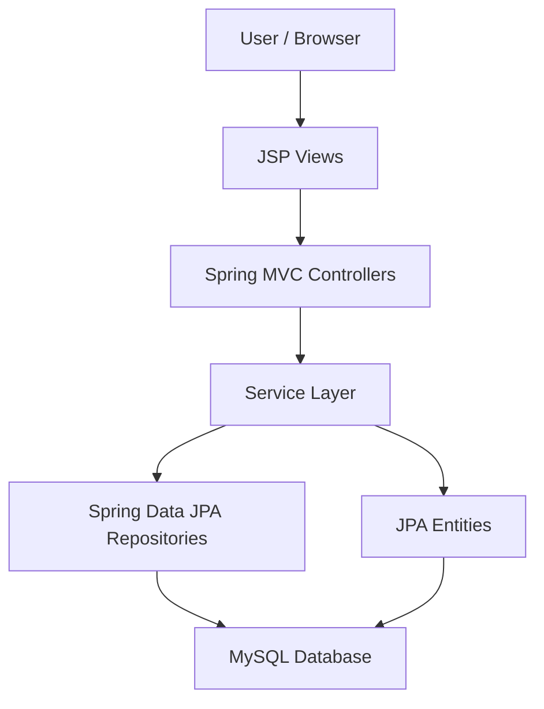
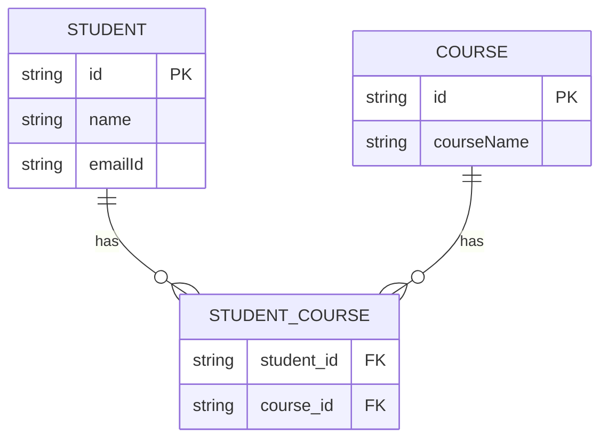

# Student Course Management System

**Assignment Documentation**  
**Institution:** Birla Institute of Technology and Science, Pilani  
**Technology Stack:** Java 17, Spring Boot, Spring MVC, Spring Data JPA, JSP, JSTL, MySQL, H2, Maven  
**Project Path:** `C:\Users\ss232\practice_code\Student-Course-Management-System`

---

## 1. Introduction

The Student Course Management System is a web-based Spring Boot application designed to manage student records, course records, and the relationship between students and the courses they are enrolled in. The project follows a layered MVC architecture and uses JSP pages for the user interface, Spring MVC controllers for request handling, service classes for business logic, Spring Data JPA repositories for database operations, and JPA entities for object-relational mapping.

The application supports common academic administration workflows such as adding students, adding courses, updating details, viewing student-course assignments, and deleting records while maintaining the many-to-many relationship between students and courses.

## 2. Objectives

The main objectives of this project are:

- To develop a CRUD-based student and course management application using Spring Boot.
- To implement a layered architecture with separate controller, service, repository, and entity packages.
- To persist application data using Spring Data JPA and a relational database.
- To demonstrate a many-to-many relationship between `Student` and `Course` entities.
- To provide a browser-based interface using JSP and JSTL.
- To include automated tests using Spring Boot Test, H2 database, and TestRestTemplate.

## 3. Scope of the Project

The system covers the following functional areas:

- Student management: create, view, update, delete, and inspect student details.
- Course management: create, view, update, and delete course records.
- Course assignment: assign one or more courses to a student using checkboxes in the student form.
- Dashboard: show total student and course counts and provide navigation links.
- Testing: verify page rendering and core CRUD workflows using an in-memory H2 test database.

## 4. Technology Stack

| Layer | Technology Used | Purpose |
|---|---|---|
| Programming Language | Java 17 | Main application development language |
| Framework | Spring Boot 3.3.5 | Application configuration and runtime |
| Web Layer | Spring MVC | Controller-based request handling |
| View Layer | JSP and JSTL | Server-side rendered web pages |
| Persistence | Spring Data JPA and Hibernate | ORM and database interaction |
| Database | MySQL | Main runtime database |
| Test Database | H2 | In-memory database for automated tests |
| Build Tool | Maven | Dependency management and build execution |
| Testing | JUnit 5, AssertJ, TestRestTemplate | Application and web workflow testing |

## 5. Project Structure

```text
Student-Course-Management-System
|-- pom.xml
|-- src
|   |-- main
|   |   |-- java
|   |   |   `-- com.project.Student.Course.Management.System
|   |   |       |-- Application.java
|   |   |       |-- controller
|   |   |       |   |-- DashboardController.java
|   |   |       |   |-- StudentController.java
|   |   |       |   `-- CourseController.java
|   |   |       |-- entity
|   |   |       |   |-- Student.java
|   |   |       |   `-- Course.java
|   |   |       |-- repository
|   |   |       |   |-- StudentRepository.java
|   |   |       |   `-- CourseRepository.java
|   |   |       `-- service
|   |   |           |-- StudentService.java
|   |   |           `-- CourseService.java
|   |   |-- resources
|   |   |   `-- application.properties
|   |   `-- webapp
|   |       `-- WEB-INF
|   |           `-- views
|   |               |-- dashboard.jsp
|   |               |-- listStudents.jsp
|   |               |-- addStudent.jsp
|   |               |-- updateStudent.jsp
|   |               |-- studentDetails.jsp
|   |               |-- listCourses.jsp
|   |               |-- addCourse.jsp
|   |               `-- updateCourse.jsp
|   `-- test
|       |-- java
|       |   `-- com.project.Student.Course.Management.System
|       |       `-- ApplicationTests.java
|       `-- resources
|           `-- application.properties
```

## 6. System Architecture

The application follows the Model-View-Controller pattern.



### Architecture Explanation

- The browser sends requests to Spring MVC controllers.
- Controllers prepare model data and select JSP views.
- Services contain the business logic and validation checks.
- Repositories provide database access through Spring Data JPA.
- Entities represent database tables and relationships.
- JSP pages render the user interface using model attributes.

## 7. Main Modules

### 7.1 Dashboard Module

The dashboard is handled by `DashboardController`. It provides the home page of the application and displays:

- Total number of students.
- Total number of courses.
- Navigation links for student and course workflows.
- Quick actions for viewing student details and editing courses by ID.

Mapped routes:

| URL | Purpose |
|---|---|
| `/` | Opens dashboard |
| `/dashboard` | Opens dashboard |
| `/dashboard/student/details?id={id}` | Redirects to student details |
| `/dashboard/student/edit?id={id}` | Redirects to student edit form |
| `/dashboard/student/delete?id={id}` | Redirects to student delete action |
| `/dashboard/course/edit?id={id}` | Redirects to course edit form |
| `/dashboard/course/delete?id={id}` | Redirects to course delete action |

### 7.2 Student Module

The student module is handled by `StudentController` and `StudentService`. It supports the complete student lifecycle.

| URL | HTTP Method | Description |
|---|---:|---|
| `/student/all` | GET | Displays all students |
| `/student/details/{id}` | GET | Displays one student with assigned courses |
| `/student/add` | GET | Opens add student form |
| `/student/save` | POST | Saves a new student |
| `/student/edit/{id}` | GET | Opens update form for an existing student |
| `/student/update` | POST | Updates student details and assigned courses |
| `/student/delete/{id}` | GET | Deletes a student |

Important behavior:

- Student IDs are manually entered.
- A student has fields for ID, name, and email.
- Multiple courses can be assigned to a student.
- During update, already selected courses are pre-checked in the form.
- During deletion, the service first clears the student-course relationship before deleting the student record.

### 7.3 Course Module

The course module is handled by `CourseController` and `CourseService`.

| URL | HTTP Method | Description |
|---|---:|---|
| `/course/all` | GET | Displays all courses |
| `/course/add` | GET | Opens add course form |
| `/course/save` | POST | Saves a new course |
| `/course/edit/{id}` | GET | Opens update form for an existing course |
| `/course/update` | POST | Updates course details |
| `/course/delete/{id}` | GET | Deletes a course |

Important behavior:

- Course IDs are manually entered.
- A course contains an ID and course name.
- Before deleting a course, the service removes that course from all related student records.
- This prevents relationship issues in the join table.

## 8. Database Design

The application uses two main entities: `Student` and `Course`. Since one student can enroll in multiple courses and one course can have multiple students, the system implements a many-to-many relationship.

### 8.1 Student Entity

| Field | Type | Description |
|---|---|---|
| `id` | String | Primary key for student |
| `name` | String | Student name |
| `emailId` | String | Student email address |
| `courseList` | List<Course> | Courses assigned to the student |

### 8.2 Course Entity

| Field | Type | Description |
|---|---|---|
| `id` | String | Primary key for course |
| `courseName` | String | Name of the course |
| `students` | List<Student> | Students enrolled in the course |

### 8.3 Relationship Mapping

The many-to-many relationship is implemented using a join table named `student_course`.

| Join Table Column | Description |
|---|---|
| `student_id` | Refers to the student ID |
| `course_id` | Refers to the course ID |



## 9. Repository Layer

### StudentRepository

`StudentRepository` extends `JpaRepository<Student, String>`. It provides built-in CRUD operations and also defines custom queries:

- `getStudentCourseDetails()` fetches student-course join details.
- `findByIdWithCourses(String id)` fetches a student with courses using `LEFT JOIN FETCH`.

The fetch query is useful because many-to-many collections can be lazily loaded, and the details or edit pages require course data to be available.

### CourseRepository

`CourseRepository` extends `JpaRepository<Course, String>`. It uses Spring Data JPA's built-in methods such as:

- `findAll()`
- `findById(id)`
- `save(course)`
- `delete(course)`
- `count()`

## 10. Service Layer

The service layer separates business logic from the controller layer.

### StudentService Responsibilities

- Fetch all students.
- Save a student with selected course IDs.
- Fetch a student by ID.
- Fetch a student with assigned courses.
- Delete a student after clearing course associations.
- Handle data access exceptions with meaningful runtime exceptions.

### CourseService Responsibilities

- Fetch all courses.
- Fetch a course by ID.
- Save course details.
- Delete a course after removing it from all assigned students.
- Handle database-related exceptions.

## 11. View Layer

The application uses JSP files stored under:

```text
src/main/webapp/WEB-INF/views
```

The view resolver is configured in `application.properties`:

```properties
spring.mvc.view.prefix=/WEB-INF/views/
spring.mvc.view.suffix=.jsp
```

Important JSP files:

| JSP File | Purpose |
|---|---|
| `dashboard.jsp` | Main dashboard with counts and navigation |
| `listStudents.jsp` | Student list table |
| `addStudent.jsp` | Form to create a student and assign courses |
| `updateStudent.jsp` | Form to update student data and selected courses |
| `studentDetails.jsp` | Detailed view of one student |
| `listCourses.jsp` | Course list table |
| `addCourse.jsp` | Form to create a course |
| `updateCourse.jsp` | Form to update course details |

## 12. Application Configuration

The main runtime configuration uses MySQL:

```properties
spring.datasource.url=jdbc:mysql://localhost:3306/student_db
spring.datasource.driver-class-name=com.mysql.cj.jdbc.Driver
spring.jpa.hibernate.ddl-auto=update
spring.jpa.show-sql=true
spring.jpa.database-platform=org.hibernate.dialect.MySQLDialect
server.port=8081
```

The test configuration uses an H2 in-memory database:

```properties
spring.datasource.url=jdbc:h2:mem:student_course_test_db;DB_CLOSE_DELAY=-1;MODE=MySQL
spring.jpa.hibernate.ddl-auto=create-drop
spring.jpa.database-platform=org.hibernate.dialect.H2Dialect
```

Using H2 for tests makes the tests independent of the local MySQL database.

## 13. Workflow Description

### 13.1 Add Course Workflow

1. User opens `/course/add`.
2. JSP form accepts course ID and course name.
3. Form submits to `/course/save`.
4. `CourseController` passes the course object to `CourseService`.
5. `CourseRepository` saves the record.
6. User is redirected to `/course/all`.

### 13.2 Add Student Workflow

1. User opens `/student/add`.
2. Controller loads all courses and sends them to the form.
3. User enters student ID, name, email, and selects courses.
4. Form submits to `/student/save`.
5. `StudentService` loads selected courses using `courseRepo.findAllById(courseIds)`.
6. The selected courses are assigned to the student.
7. Student is saved through `StudentRepository`.
8. User is redirected to `/student/all`.

### 13.3 Update Student Workflow

1. User opens `/student/edit/{id}`.
2. Controller fetches the student with assigned courses.
3. Existing course IDs are extracted and sent as `selectedCourseIds`.
4. JSP checks the matching course checkboxes.
5. User updates details and submits the form.
6. The student record and course relationship are saved again.

### 13.4 Delete Course Workflow

1. User selects delete for a course.
2. `CourseService` fetches all students.
3. The selected course is removed from every student's course list.
4. Updated students are saved.
5. The course record is deleted.

## 14. Testing

The project contains automated tests in `ApplicationTests.java`. The tests run the application using a random web port and use `TestRestTemplate` to make HTTP requests.

Test coverage includes:

- Application context loading.
- Student list page rendering.
- Student add page rendering.
- Student details page with course display.
- Student edit page with selected courses checked.
- Student update with multiple course assignments.
- Student deletion while preserving course records.
- Course list and add page rendering.
- Course creation, update, and deletion.

The test profile uses H2 instead of MySQL, which keeps automated tests fast and repeatable.

## 15. How to Run the Project

### Prerequisites

- Java 17 installed.
- Maven wrapper included in the project.
- MySQL server running locally.
- Database named `student_db` created in MySQL.

### Database Setup

Create the database:

```sql
CREATE DATABASE student_db;
```

Update the MySQL username and password in:

```text
src/main/resources/application.properties
```

### Run the Application

From the project root:

```bash
.\mvnw.cmd spring-boot:run
```

Open the application in the browser:

```text
http://localhost:8081/dashboard
```

### Run Tests

```bash
.\mvnw.cmd test
```

## 16. Strengths of the Project

- Clear MVC-based structure.
- Separate packages for controller, service, repository, and entity logic.
- Many-to-many JPA relationship between students and courses.
- JSP-based browser interface for all major workflows.
- Dashboard with summary counts and navigation.
- H2-based automated tests for stable test execution.
- Service methods include validation and database exception handling.

## 17. Limitations

- Student and course IDs are manually entered by the user.
- The current UI is functional but simple in some pages.
- Authentication and role-based access control are not implemented.
- Input validation is limited at the form and entity level.
- Delete operations use GET requests, which is simple for assignment use but should normally be handled using POST or DELETE in production systems.
- Database credentials are configured in a properties file and should be externalized for production deployment.

## 18. Future Enhancements

The following improvements can be added in future versions:

- Add login and role-based access for admin users.
- Use Bean Validation annotations such as `@NotBlank`, `@Email`, and `@Size`.
- Add global exception handling with `@ControllerAdvice`.
- Improve UI consistency across all JSP pages.
- Add search and filtering for students and courses.
- Add pagination for large datasets.
- Generate automatic student and course IDs.
- Add REST APIs for integration with external systems.
- Add audit fields such as created date and updated date.
- Move database credentials to environment variables.

## 19. Conclusion

The Student Course Management System successfully demonstrates a Spring Boot-based academic management application. It implements student management, course management, and student-course assignment using Spring MVC, JSP, Spring Data JPA, and MySQL. The layered design improves maintainability by separating web logic, business logic, and database access. The many-to-many entity relationship provides a practical example of real-world academic data modeling, while the automated tests validate important workflows using an H2 in-memory database.

Overall, the project is suitable as an academic assignment because it demonstrates the practical use of Java, Spring Boot, MVC architecture, database persistence, relationship mapping, and test-driven verification of core web workflows.

